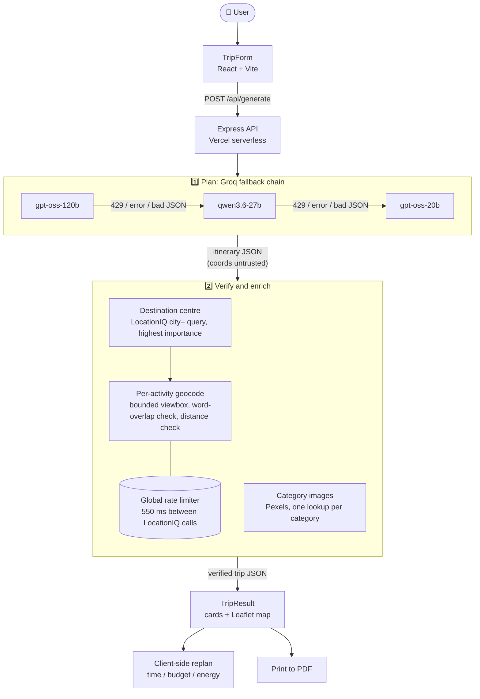

<div align="center">


# 🌍 Voyager

### AI-powered travel planner that verifies what the AI tells it

**Stop planning your trips with 50 open tabs.**
Tell Voyager where you're going, for how long, with whom and on what budget. You get a day-by-day itinerary with real map pins, real photos and real costs, and you can replan any day in one click.

<br />

[](https://voyager-node-f-inal-fefq.vercel.app/)
[](https://www.linkedin.com/posts/siva-charan-kg-72a900284_traveltech-generativeai-llm-ugcPost-7425072513896017920-r3tk)
[](https://github.com/Siva2583/Voyager-Node-FInal)


[About](#-about) •
[Features](#-features) •
[How it works](#-how-it-works) •
[Quick start](#-quick-start) •
[API](#-api-reference) •
[Engineering notes](#-engineering-deep-dive) •
[Limitations](#-known-limitations)

</div>

---

## 📖 About

Voyager is a full-stack app that generates personalised, day-by-day travel itineraries. Most "AI trip planners" are a prompt and a text box. The model's answer is shown as-is, so it often contains invented hotels, wrong coordinates and made-up prices.

Voyager treats the LLM as an **untrusted planner** and puts a verification pipeline behind it:

| Promise | How Voyager delivers it |
|---|---|
| 📍 **Geographically honest** | Every activity is geocoded independently with LocationIQ. The coordinates the LLM returns are discarded. Each match is checked against the returned address text and against a distance limit from the destination. |
| 💰 **Numbers that add up** | The LLM only returns a *per-person* cost. The UI does the maths (`cost × travelers`), so the model never does arithmetic. |
| 🖼️ **Relevant visuals** | Pexels photos are matched to the activity category (hotel, temple, market…) and fetched once per category, not once per card. |
| ⚡ **Fast and resilient** | Groq inference returns in a few seconds. If one model is rate-limited or returns bad JSON, the next model in the chain takes over. |

> **v2.1** replaced Nominatim and Wikipedia enrichment with a verified LocationIQ + Pexels pipeline. The reason: free geocoders can silently return *wrong-but-plausible* matches. See the [Engineering Deep Dive](#-engineering-deep-dive).

---

## ✨ Features

- **🧭 Complete "everything included" itineraries.** Every day has a hotel check-in, breakfast, lunch, dinner and 2–3 sightseeing stops. They are grouped by neighbourhood to keep travel time down.
- **🎛️ Rich trip form.** Destination, budget tier (Low / Standard / Luxury) with a slider up to ₹1,00,000, duration from 1 to 15 days, group presets (Solo, Couple, Friends, Family) with a custom headcount, and vibe chips (Chill, Adventure, Nature, Luxury, Party, Culture) plus your own custom vibes.
- **🧠 Multi-model fallback chain.** Three Groq-hosted models are tried in order, with a per-model timeout, 429 handling and response-shape validation.
- **📌 Verified map pins.** Leaflet map on CartoDB tiles. Click a card and the map flies to that place. Click a marker and the matching card opens.
- **🖼️ Category-matched photos.** Real Pexels photos, with a fallback image if a lookup fails.
- **🔄 Smart replan, with no extra API call.** Reshape any single day by **time**, **budget** or **energy**. Removed activities are greyed out with a reason.
- **🖨️ One-click PDF.** *Download PDF* uses a dedicated print layout. It shows a clean itinerary with per-person-times-group costs, without the map or UI chrome.
- **📱 Responsive.** On mobile the map moves to the top and the form collapses to a single column.
- **🎬 Polished UX.** Animated landing page, live trip preview while you fill the form, and an animated loading screen.

---

## 🏗️ How it works



**Request lifecycle** (`POST /api/generate`):

1. **Validate** the input (`location` and `days` are required) and check that `GROQ_API_KEY` exists.
2. **Prompt** a Groq model with strict realism rules: real places only, per-person costs, a specific `area`, and a `category` from a fixed list. If the model isn't confident a business exists, it must describe it generically instead of inventing a name.
3. **Fall back** through the model chain until one returns valid JSON with a non-empty `itinerary`.
4. **Resolve the destination centre** using a structured `city=` LocationIQ query.
5. **Enrich**: fetch category images, then geocode every activity in small batches through the shared rate limiter.
6. **Respond** with the verified trip. If enrichment fails partway, the trip is still returned with whatever was enriched.

---

## 🛠️ Tech Stack

| Layer | Technology |
|---|---|
| **Frontend** | React 18, React Router v6, Vite 5, Axios, Leaflet + React-Leaflet, hand-written CSS |
| **Backend** | Node.js, Express 4, CORS, dotenv, native `fetch` with `AbortController` timeouts |
| **AI** | [Groq Cloud](https://console.groq.com) (`openai/gpt-oss-120b` → `qwen/qwen3.6-27b` → `openai/gpt-oss-20b`) |
| **Data APIs** | [LocationIQ](https://locationiq.com) (geocoding), [Pexels](https://www.pexels.com/api) (images), CartoDB (map tiles) |
| **Deployment** | Vercel (static frontend + `@vercel/node` serverless backend) |

---

## 📁 Project Structure

```
Voyager-Node-FInal/
├── client/                          # ⚛️ React + Vite frontend
│   ├── src/
│   │   ├── components/
│   │   │   ├── TripForm.jsx         # Landing page + planner form (vibes, budget, travelers)
│   │   │   ├── Loading.jsx          # Animated "Designing Your Trip" screen
│   │   │   ├── TripResult.jsx       # Day tabs, cards, Leaflet map, replan modal, print layout
│   │   │   ├── load.css             # Dashboard, loader, modal and @media print styles
│   │   │   └── voyager-logo.png     # Brand logo
│   │   ├── App.jsx                  # Routes: /  →  /loading  →  /result
│   │   ├── main.jsx                 # React entry point
│   │   └── index.css                # Global reset
│   ├── index.html                   # Loads Poppins + Leaflet CSS
│   ├── vite.config.js               # Dev server with /api proxy to :3000
│   └── package.json
│
├── server/                          # 🟢 Express backend (single file)
│   ├── index.js                     # Routes, Groq chain, geocoding, images, rate limiter
│   ├── vercel.json                  # Routes every request to index.js via @vercel/node
│   └── package.json
│
├── package.json                     # Root scripts: build (client), start (server)
├── drizzle.config.json              # ⚠️ Unused starter leftover (no database in the app)
├── eslint.config.mjs                # ⚠️ Unused starter leftover (Next.js preset)
└── .gitignore
```

---

## ⚙️ Quick Start

### Prerequisites

| Requirement | Notes |
|---|---|
| **Node.js** | v18+ (the server relies on the built-in global `fetch`) |
| **npm** | v9+ |
| **Groq API key** | Free at [console.groq.com](https://console.groq.com). **Required.** |
| **LocationIQ key** | Free tier at [locationiq.com](https://locationiq.com). Optional but recommended: without it, pins are missing. |
| **Pexels key** | Free at [pexels.com/api](https://www.pexels.com/api). Optional: without it, every card gets the fallback image. |

### 1. Clone

```bash
git clone https://github.com/Siva2583/Voyager-Node-FInal.git
cd Voyager-Node-FInal
```

### 2. Start the backend

```bash
cd server
npm install
```

Create `server/.env`:

```env
GROQ_API_KEY=your_groq_api_key
LOCATIONIQ_KEY=your_locationiq_api_key
PEXELS_API_KEY=your_pexels_api_key
PORT=3000
```

```bash
npm start        # → Voyager server running on port 3000
```

Quick check: `curl http://localhost:3000/api/health` should return `{"ok":true}`.

### 3. Start the frontend

In a second terminal:

```bash
cd client
npm install
```

Create `client/.env`:

```env
VITE_API_URL=http://localhost:3000
```

```bash
npm run dev      # → http://localhost:5173
```

> ℹ️ `VITE_API_URL` is **required**. The form calls `${VITE_API_URL}/api/generate` directly. The `/api` proxy in `vite.config.js` targets port `3000`. If you change the backend `PORT`, update both places.

### 4. Plan a trip 🎉

Open **http://localhost:5173**, click **Start Journey**, fill in the form and hit **Build My Journey**. Generation usually takes a few seconds for the LLM, plus geocoding time that grows with the number of activities (see [rate limiting](#4-one-global-rate-limiter-because-retries-can-reintroduce-the-bug-they-fix)).

### Root scripts

| Command (repo root) | What it does |
|---|---|
| `npm run build` | Installs client deps and builds the frontend (`client/dist`) |
| `npm start` | Runs `node server/index.js` |

---

## 🔐 Environment Variables

| Variable | Where | Required | Description |
|---|---|---|---|
| `GROQ_API_KEY` | `server/.env` | ✅ | Groq Cloud key. Without it, `/api/generate` returns `500 GROQ_API_KEY not configured`. |
| `LOCATIONIQ_KEY` | `server/.env` | ⚠️ Recommended | Enables geocoding. If missing, geocoding is skipped and activities get no `coords`. |
| `PEXELS_API_KEY` | `server/.env` | ⚠️ Recommended | Enables category photos. If missing, every activity gets a fixed fallback photo. |
| `PORT` | `server/.env` | ❌ | Backend port (default `3000`). |
| `VITE_API_URL` | `client/.env` (or Vercel env) | ✅ | Base URL of the backend, with no trailing slash. |

Never commit `.env` files. They are already covered by `.gitignore`.

---

## 📡 API Reference

Base URL: `http://localhost:3000` locally, or your deployed server.

### `GET /`
Returns `{ "status": "Voyager API running" }`.

### `GET /api/health`
Health check. Returns `{ "ok": true }`.

### `POST /api/generate`
Generates a complete, verified itinerary.

**Request body**

```json
{
  "location": "Goa",
  "days": 3,
  "people": 2,
  "budget_tier": "Standard",
  "total_budget": 40000
}
```

| Field | Type | Required | Default | Description |
|---|---|---|---|---|
| `location` | string | ✅ | — | Destination, e.g. `"Goa"`, `"Manali"` |
| `days` | number | ✅ | — | Trip length in days |
| `people` | number | ❌ | `1` | Number of travelers |
| `budget_tier` | string | ❌ | `"Medium"` | The UI sends `"Low Budget"`, `"Standard"` or `"Luxury"` |
| `total_budget` | number | ❌ | `"Flexible"` | Total group budget in **INR** |

> The form also sends a `vibe` array. The server currently **does not read it** (see [Known Limitations](#-known-limitations)).

**Response `200`**

```json
{
  "trip_name": "Authentic Journey: Goa",
  "total_budget": "Total for 2 travelers",
  "itinerary": [
    {
      "day": 1,
      "activities": [
        {
          "id": "goa_d1_a1",
          "time": "08:00 AM",
          "place": "Baga Beach",
          "area": "Baga, North Goa",
          "category": "sightseeing",
          "desc": "Pro-tip: visit before 9 AM to avoid crowds.",
          "cost": 0,
          "duration": 90,
          "priority": "high",
          "energy": "low",
          "coords": [15.5573721, 73.75098],
          "image": "https://images.pexels.com/photos/..."
        }
      ]
    }
  ]
}
```

| Activity field | Notes |
|---|---|
| `cost` | **Per person**, in INR. The UI multiplies by the traveler count. |
| `category` | One of `hotel`, `restaurant`, `sightseeing`, `temple`, `market`, `transport`. Drives image selection. |
| `area` | Neighbourhood or locality. Used to sharpen geocoding. |
| `priority` / `energy` | `high` / `medium` / `low`. Used by the replan engine. |
| `coords` | `[lat, lon]`, **always set by the server, never by the LLM**. If a place can't be verified it falls back to the destination centre. |
| `image` | Pexels URL matched to the category. |

**Errors**

| Status | Body | Cause |
|---|---|---|
| `400` | `{"error":"location and days are required"}` | Missing input |
| `500` | `{"error":"GROQ_API_KEY not configured"}` | Server misconfigured |
| `500` | `{"error":"Service busy. Try again."}` | Every model in the chain failed or was rate-limited |

### Diagnostic endpoints

| Endpoint | Purpose |
|---|---|
| `GET /api/debug-env` | Reports which API keys are configured (booleans only, never the values). |
| `GET /api/debug-geocode?place=…&area=…&location=…` | Runs the geocoder for one place and returns the destination centre, resolved coordinates and distance. |

> These helped debug production geocoding. Consider disabling or protecting them in a public deployment, because they can spend your LocationIQ quota.

---

## 🔄 Replan Engine

Replanning runs entirely in the browser using the metadata already in the response. There are no extra API calls and the result is instant.

| Mode | Rule |
|---|---|
| ⏱ **Less Time** | Sorts the day by priority (high → low) and keeps activities until a **6-hour (360 min)** budget is used. The rest are marked *Not enough time*. |
| 💰 **Lower Budget** | Removes **low**-priority items costing over ₹500 and **medium**-priority items over ₹2,000 (group total). Reason: *Budget saving*. |
| 😴 **Low Energy** | Removes every `energy: "high"` activity. Reason: *Too tiring*. |

Removed activities are greyed out, drop off the map and are left out of the PDF.

---

## 🧠 Engineering Deep Dive

The pipeline in `server/index.js` exists because of real bugs found in production. Here are the problems and how each was fixed.

### 1. Never trust the LLM's coordinates

**Problem:** Early versions asked the model for `coords`. It made up plausible numbers (a hotel, a fort and a restaurant all within ~100 m of each other). Because they weren't `[0, 0]`, the code treated them as valid and **skipped geocoding**.

**Fix:** The model's coordinates are ignored on purpose. Every activity is looked up for real.

```js
async function geocodeActivity(activity, locationContext, destinationCenter) {
  // LLM-provided coords are ignored on purpose — always verify for real
  const geocoded = await geocodePlace(activity.place, activity.area, locationContext, destinationCenter);
  activity.coords = geocoded || destinationCenter || null;
  return activity;
}
```

### 2. Word-overlap validation against fuzzy matches

**Problem:** Free geocoders do fuzzy matching. Searching "Shree Mangueshi Temple" once returned a real place 23 km away, with no error.

**Fix:** The top result's `display_name` must share at least one meaningful word (4 or more characters) with the place name. Otherwise the match is rejected as low confidence.

```js
function nameOverlapsResult(placeName, displayName) {
  const placeWords = normalizeWords(placeName);
  const resultWords = new Set(normalizeWords(displayName));
  if (placeWords.length === 0) return true;
  return placeWords.some((w) => resultWords.has(w));
}
```

### 3. Structured destination-centre lookup

**Problem:** A trip to "Goa" once anchored to a hamlet named Goa in Himachal Pradesh, 1,500 km away. "Kurnool" resolved to the district centroid instead of the city.

**Fix:** Use a structured `city=` query (country-scoped) and pick the **highest-`importance`** result of up to five, with a free-text fallback.

```js
function pickMostImportant(results) {
  return results.reduce((best, r) =>
    parseFloat(r.importance || 0) > parseFloat(best.importance || 0) ? r : best);
}
```

### 4. One global rate limiter, because retries can reintroduce the bug they fix

**Problem:** A smarter retry strategy meant each activity could fire up to **3** geocoding requests. Concurrent batches briefly burst past LocationIQ's free-tier limit, and most pins silently fell back to the city centre. Each piece was correct on its own, but together they undid earlier fixes.

**Fix:** A single promise queue that every LocationIQ call passes through. It spaces real network calls by 550 ms no matter how many callers there are.

```js
let locationIqQueue = Promise.resolve();
function withLocationIqRateLimit(fn) {
  const run = locationIqQueue.then(() => fn());
  locationIqQueue = run.catch(() => {}).then(() => sleep(550));
  return run;
}
```

### 5. Layered geocoding attempts with a safety net

For each activity the server tries, in order:

1. `place, area, destination`, **bounded** to a ~150 km viewbox around the destination centre
2. `place, destination`, bounded
3. `place, destination`, unbounded

A result is accepted only if it passes the **word-overlap check** and lies **within 150 km** of the destination centre (Haversine). Otherwise the pin falls back to the destination centre, which is a pin that is *honestly vague* instead of *confidently wrong*.

### 6. Multi-model fallback chain

**Problem:** A single model being rate-limited takes the whole app down.

**Fix:** `gpt-oss-120b` → `qwen3.6-27b` → `gpt-oss-20b`. A model is skipped on HTTP 429, other HTTP errors, a timeout (20 s), an empty body, unparseable JSON, or a response without a non-empty `itinerary` array.

### 7. LLM output safety

A layered defence: a system prompt demanding JSON only, Groq's `json_object` response mode, `temperature: 0.1`, stripping of stray Markdown fences, and a shape check before anything is trusted. The prompt also tells the model to describe a business generically if it isn't sure it exists ("A local tiffin centre near Bandar Road"), because *vaguely correct beats specifically wrong*.

### 8. Image strategy

Images are resolved **per category**, not per activity. An `activity.category` maps to a curated Pexels query. Unknown categories fall back to keyword matching on the name and description (`temple|mandir`, `fort|palace`, `beach`, …). Identical queries are de-duplicated, fetched in parallel, and shared across cards. That means fewer API calls, consistent visuals and no stray, unrelated stock photos.

### 9. Client-side replanning

Re-calling the AI for small tweaks is slow and costly. The response carries `priority`, `energy`, `duration` and `cost` per activity, so the client can optimise locally. See [Replan Engine](#-replan-engine).

---

## 🚀 Deployment

Voyager is set up for **Vercel**. The backend ships a `vercel.json` that routes every request to `index.js` through `@vercel/node`. The frontend is a standard Vite static build.

The simplest setup is two Vercel projects from the same repo:

| Project | Root Directory | Build | Environment variables |
|---|---|---|---|
| **API** | `server` | Auto (`@vercel/node`) | `GROQ_API_KEY`, `LOCATIONIQ_KEY`, `PEXELS_API_KEY` |
| **Web** | `client` | `npm run build` → `dist` | `VITE_API_URL` = URL of the API project |

Notes:

- Environment variables from local `.env` files **don't carry over**. Add them in *Project → Settings → Environment Variables* and **redeploy**.
- `VITE_API_URL` is baked in at build time, so redeploy the frontend after changing it.
- Client-side routes (`/loading`, `/result`) need an SPA rewrite to `index.html` on the Web project.
- Serverless function timeouts: a generation does a 5,500-token LLM call plus rate-limited geocoding (≈0.55 s per lookup, so longer trips take longer). For multi-day trips, check your plan's function duration limit. The client waits up to 100 s.

---

## 🧭 Known Limitations

This is the honest list of rough edges, so you don't have to find them yourself.

- **India-first.** Geocoding is restricted to `countrycodes=in`, prompts talk in ₹ INR, and image queries lean "india …". The form's placeholder mentions Kyoto and Paris, but non-Indian destinations will **not** geocode correctly today.
- **Small local businesses are the soft edge.** A small restaurant or guesthouse can still geocode to a same-named place elsewhere if the address text happens to overlap. Landmarks and well-known hotels are consistently accurate. Fixing the rest properly needs a paid places dataset such as Google Places.
- **Vibes aren't used yet.** The form collects vibes and sends them, but the server prompt doesn't include them.
- **No persistence.** The trip lives in React Router state, so refreshing `/result` returns you to the form. There are no accounts or saved trips.
- **Replan is a filter, not a re-optimiser.** It hides activities. It doesn't find replacements or re-time the day. "Less Time" also reorders the day by priority.
- **Geocoding latency scales with trip length.** The 550 ms spacing is what keeps pins accurate on the free tier.
- **Diagnostic endpoints are unauthenticated** (see above).
- **No automated tests or linter config that applies to this codebase yet.** `eslint.config.mjs` and `drizzle.config.json` are leftovers from a starter template.

---

## 🗺️ Roadmap Ideas

- [ ] Feed the selected **vibes** into the prompt
- [ ] Global destinations (country-aware geocoding, multi-currency)
- [ ] Persist and share trips (shareable links)
- [ ] Replacement suggestions when an activity is removed during replan
- [ ] Route lines and travel times between stops on the map
- [ ] Response caching per `(location, days, tier)`
- [ ] Tests for the geocoding helpers (`nameOverlapsResult`, `pickMostImportant`, `haversineDistanceKm`)

---

## 📊 Version History

| | v1 (Python) | v2.0 (Node.js) | v2.1 (verified pipeline) ✨ |
|---|---|---|---|
| **Backend** | Python + Flask + Gunicorn | Node.js + Express | Node.js + Express |
| **AI** | Google Gemini Pro | Groq (single model) | Groq multi-model fallback chain |
| **Geocoding** | ❌ None | Nominatim (unverified) | **LocationIQ + overlap + distance validation + rate limiting** |
| **Images** | ❌ None | Wikipedia / random stock | **Pexels, category-matched, cached per category** |
| **Coordinate trust** | — | Trusted LLM output | **LLM output always discarded and re-verified** |
| **Map tiles** | — | Raw OSM tile server | **CartoDB tiles** |
| **Concurrency safety** | ❌ | Unbounded parallel requests | **Global rate-limited queue** |
| **Replanning** | ❌ | ✅ Time / Budget / Energy | ✅ Time / Budget / Energy |
| **Deployment** | Vercel + Railway | Vercel only | Vercel only |

---

## 🤝 Contributing

Issues and PRs are welcome.

1. Fork the repo and create a branch: `git checkout -b feature/my-idea`
2. Run the backend and frontend locally (see [Quick Start](#-quick-start))
3. Keep changes focused, and explain *why* in the PR description, especially for anything touching the geocoding pipeline
4. Open a pull request

---

## 📬 Contact

<div align="center">

**Built by [Siva Charan KG](https://www.linkedin.com/in/siva-charan-kg-72a900284)**

[](https://www.linkedin.com/in/siva-charan-kg-72a900284)
[](https://github.com/Siva2583)
[](https://www.linkedin.com/posts/siva-charan-kg-72a900284_traveltech-generativeai-llm-ugcPost-7425072513896017920-r3tk)

**If Voyager helped you, drop a ⭐. It means a lot!**

<a href="https://voyager-node-f-inal-fefq.vercel.app/">
  
</a>

</div>
